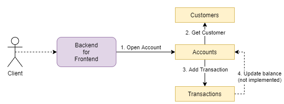
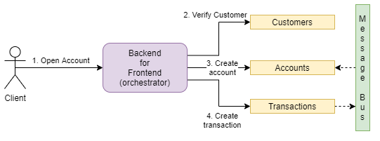
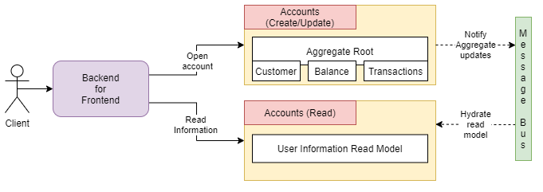
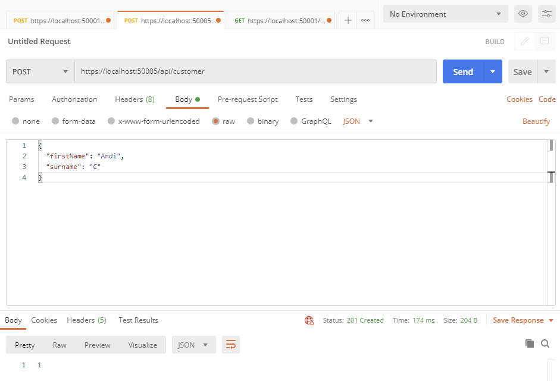
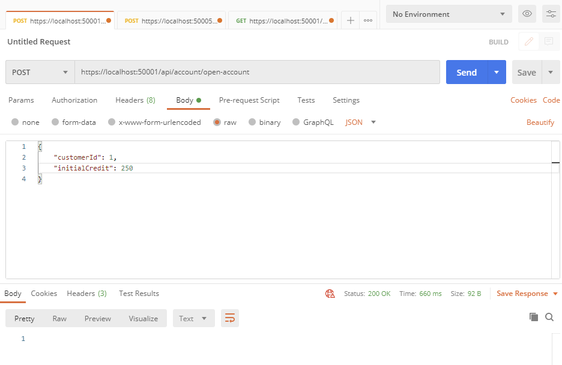
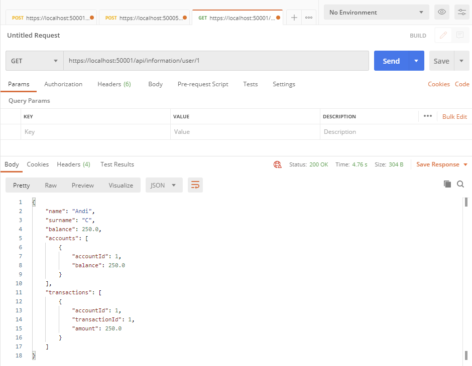
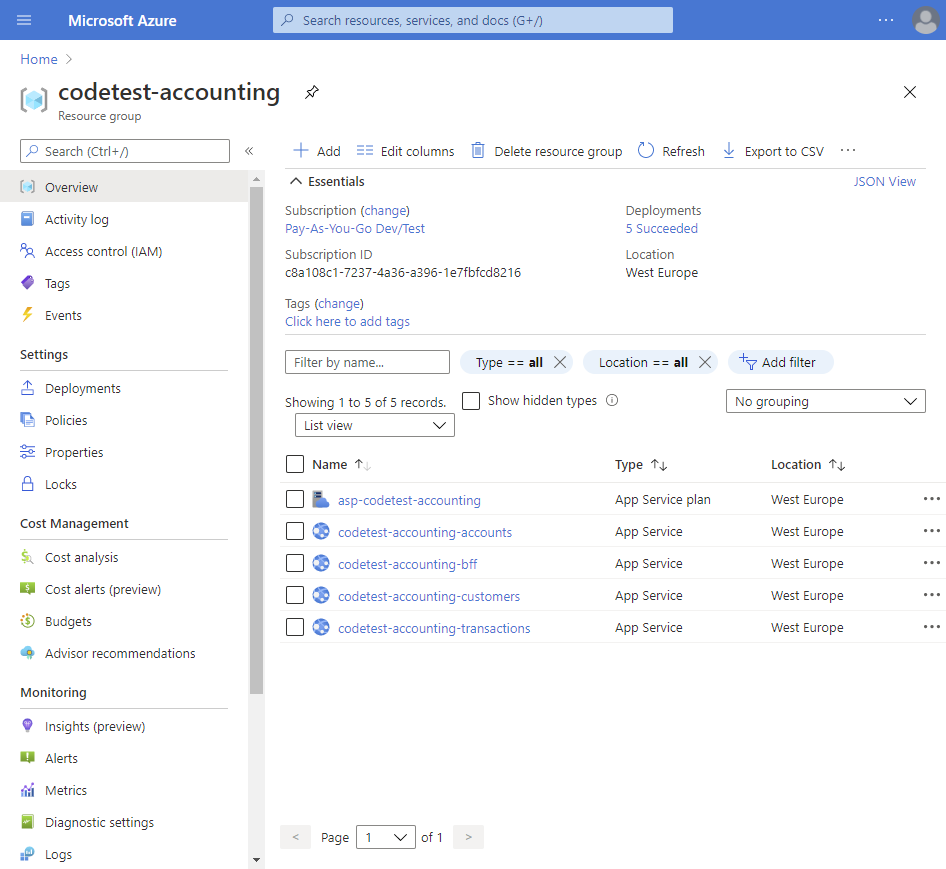
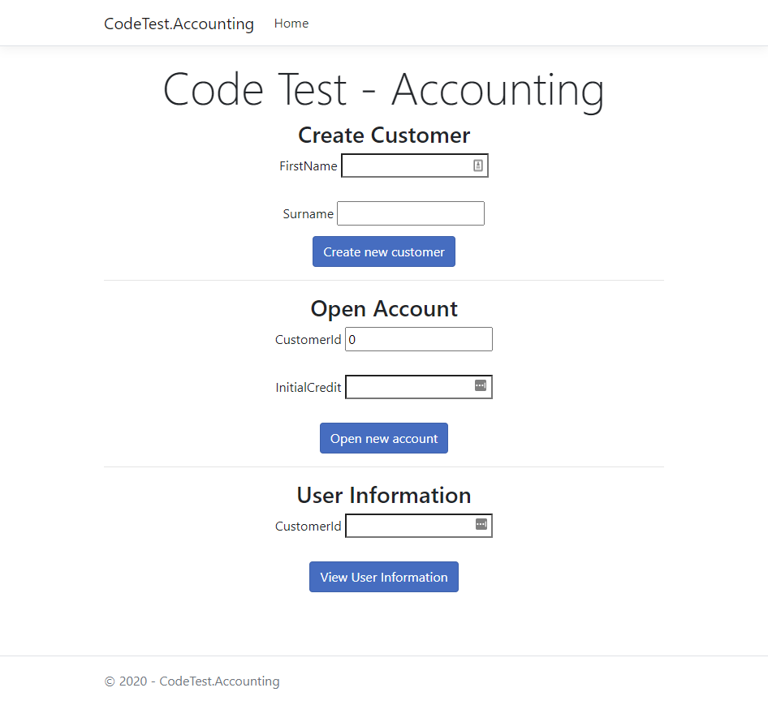

# Code Test - Accounting
A code test showcasing a (small) Accounting backend distributed system based on microservices.

## Table of Contents
- [Code Test - Accounting](#code-test---accounting)
  - [Table of Contents](#table-of-contents)
  - [Problem Statement](#problem-statement)
  - [Solution Analysis](#solution-analysis)
    - [Variant 1 - Self-Orchestrating (Micro)Services](#variant-1---self-orchestrating-microservices)
      - [Pros](#pros)
      - [Cons](#cons)
    - [Variant 2 - Isolated (Micro)Services. Central Orchestrator.](#variant-2---isolated-microservices-central-orchestrator)
      - [Pros](#pros-1)
      - [Cons](#cons-1)
    - [Variant 3 - Backend for Frontend + Domain Driven Designed Services](#variant-3---backend-for-frontend--domain-driven-designed-services)
      - [Pros](#pros-2)
      - [Cons](#cons-2)
    - [Conclusion](#conclusion)
  - [Implementation](#implementation)
    - [Architecture](#architecture)
    - [Service Clients](#service-clients)
    - [Running the project](#running-the-project)
    - [Automated Testing](#automated-testing)
    - [Local Manual Testing](#local-manual-testing)
  - [Deployment](#deployment)
    - [Builds (Continuous Integration)](#builds-continuous-integration)
    - [Deployments (Continuous Delivery)](#deployments-continuous-delivery)
    - [Azure Pipelines](#azure-pipelines)
  - [User Interface](#user-interface)

## Problem Statement

The assessment consists of an API to be used for opening a new “current account” of already existing
customers.

Requirements

- The API will expose an endpoint which accepts the user information (customerID,
initialCredit).
- Once the endpoint is called, a new account will be opened connected to the user whose ID is
customerID.
- Also, if initialCredit is not 0, a transaction will be sent to the new account.
- Another Endpoint will output the user information showing Name, Surname, balance, and
transactions of the accounts.

## Solution Analysis

### Variant 1 - Self-Orchestrating (Micro)Services

In this approach each service can (virtually) talk to any other service. This can have a few benenfits, and tradeoffs outlined below.

 

#### Pros
- each of the service's operations is self-contained (makes sure to keep the internal state correct)
- inspecting any operation makes it easy to understand what pieces are required to make the operation happen
- validation is part of each operation, even if remote calls to other services are required

#### Cons 
- business logic is spread apart into multiple services, and some can succeed while other fail (no central point of truth)
- services can end up referencing each other, which makes it difficult to reason about the operation's requirements
- implementation of distributed state patterns (e.g. Saga Pattern) are neccessary to make sure one business operation succeeds accross all services and to keep the state of the business operation valid

### Variant 2 - Isolated (Micro)Services. Central Orchestrator.

In this approach each service can only update it's internal state and notify other services of state updates via Events. The business logic orchestration happens in a gateway service (e.g. Backend for Frontend).

 

#### Pros
- each service's responsability is to keep it's internal state correct
- on an internal update of state, the service can choose to notify other Services (broadcast using a Message Bus, or Pub/Sub)
- business logic steps exist only in one place, the Orchestrator. This talks to all the required services and validates states
- can improve business logic visibility since it's (usually) in one single service
- we have a clear flow of data: from the Orchestrator to the Logical Services. We won't end up with a matrix of references.

#### Cons
- we need to have a central Orchestrator service, which can become a bottleneck
- updating any of the Orchestrator's client services Contracts means multiple reasons for the Orchestrator service to change - some might see it as an anti-pattern
- logical services have to trust the chain of requests for validation. Business logic validation inside the service becomes difficult since the business requirements are usually outside the service (in the Orchestrator)

### Variant 3 - Backend for Frontend + Domain Driven Designed Services

This approach is a mix of the previous 2 approaches with one big difference: there is no central orchestrator. Instead, we model Services based on the business Domain (following Domain Driven Design).

Each of the services would have a concrete Business role, and keep it's state in an Aggregate Root. This Aggregate Root would have to validate and update the internal state, always keeping it valid and up to date.

 

#### Pros
- Aggregate Roots help with keeping consistent state at all times
- we can implement nice patterns inside the data layer - like Unit of Work, and Repository
- makes it easy to work with CQRS - and building services that handle different perspectives of the State stored by the Aggregate Root
- syncronizing different business processes can be done via Asyncronous communication (Message Bus or Pub/Sub)


#### Cons
- finding the right Domain models has always been difficult; many people in different roles need to come together to find a good Domain Design
- services have a tendency to become big, thus moving away from the microservices architecture (debatable, based on "what is a microservice?")
- sooner or later, and Orchestrator Service might pop up, unless we choose an Event-based architecture

### Conclusion

There are a few valid approaches, in this repository I choose to implement the `Variant 2 - Isolated (Micro)Services. Central Orchestrator`. The reason for that is that the business requirements are very small, and I wanted to avoid potential circular references between the `Accounts` and `Transaction` services. (e.g. creating a Transaction, would prompt the Account to update it's Balance; creating an Account with InitialCredit > 0, would prompt a new Transaction).

The `BFF` service is resposible for Orchestrating the business logic, and all the Logical services expose functionality to allow changing their internal state. 

Another responsability of the `BFF` is to aggregate data required for displaying the user information. It will get user information from the Customer service, account and balance information from the Accounts service, and the transactions list from the Transactions service.

Because of the size of the project, I didn't approach the asyncronous notification (Message Bus or Pub/Sub) part. 

## Implementation

The solution consists of 3 services: Consumers, Accounts and Transactions. It also contains a `Backend for Frontend` implementation, used as an orchestrator for the operations required in the problem description.

The `BFF` implementation exposes an API, as well as a UI Controller, together with a small UI implemented with ASP Razor.

### Architecture

Since the services are really small (only do Create and Read operations), the architecture is simple, layer-based. The layers are the `Application` and `Persistence (DataAccess)`. 

> Note: normally, we would split the `Infrastructure` layer (Controllers) from the `Application` layer. In this test, having the split would only add unnecessary classes, to I prefered to have the 2 layers merged - thus the `Controllers` have direct access to the `Data Access` layer.

For the sake of simplicity and code reusability, we have a generic `IRepository<>` interface and one in-memory repository implementation.

> Note: In a real microservices scenario, databases and data access implementations should be separate. This allows segration of data storage technologies, as well as good responsability isolation among teams. Again, this data access code is shared for the sake of `DRY` (Don't repeat yourself).

### Service Clients

To showcase service connections between the BFF and the Logical serivces, I chose to generate the C# client classes based off the OpenAPI specification.

Each Logical service exposes a Swagger definition, which I imported into NSwag to generate the client classes.

Multiple approaches are valid, and these clients can be generated either dynamically at build time, or statically using the desktop NSwag Studio. I prefer the latter since the project is small and the client code can easily be inspected.

### Running the project

In order to run the project, [NET Core SDK v3.1](https://dotnet.microsoft.com/download/dotnet-core/3.1) is required. Once installed, the project can be built or published using the `dotnet` commands in CLI.

Using Visual Studio (2019), the project sources can be explored. Inside the solution there is a `Services` folder containing all the logical services.

The `BFF` project is the orchestrator so it contains business logic, as well as a simple UI.

> Recommended: inside Visual Studio, set multiple startup services for `Accounts`, `Customers`, `Transactions` and `BFF`. This will start all the services at once.

We can use `Postman` or the Swagger UI to call endpoints for either logical services, or the BFF.


### Automated Testing

The solution contains automated unit tests, that can be ran inside Visual Studio, or using the `dotnet` CLI.

There is one test project for each service, including one project for the `Persistence` layer.

The technologies used for unit testing are `NUnit` and `Moq`.

> Note: no integration, component or end-to-end tests are implemented yet.

### Local Manual Testing

In order to successfuly test the creation of an account we need two steps:
 - using the `Customers` service, create a customer

```
POST https://localhost:50005/api/customer 

BODY:
   {
    "firstName": "Andi",
    "surname": "C"
   }
```


 - using the `BFF`, open an account. This will orchestrate the validation and account creation across all services

```
POST https://localhost:50001/api/account/open-account

BODY: 
  {
    "customerId": 1,
    "initialCredit": 150
  }
```

If the customer doesn't exist, the `BFF` will return a `400 Bad Request` with `Customer not valid!` message.



 - using the `BFF`, query for User Information. This will orchestrate requests to all services, and consolidate returned data.

```
GET https://localhost:50001/api/information/user/1
```




## Deployment

The application builds and deployments are made using Azure DevOps.

The pipeline file can be found under [./pipelines/azure-pipelines.yml](https://github.com/andreicojocaru/codetest-accounting/blob/main/pipelines/azure-pipelines.yml).

### Builds (Continuous Integration)

The pipeline contains a simple `dotnet publish` for each service. This command runs `restore, build and publish` under the hood. The build artifacts are then published as pipeline artifacts, to be downloaded and deployed later on in the deployment stage.

As part of the Build steps, the Unit Tests are being ran.

### Deployments (Continuous Delivery)

Under the path [./pipelines/terraform](https://github.com/andreicojocaru/codetest-accounting/tree/main/pipelines/terraform) there are Terraform definitions for Infrastructure as Code.

These definitions create `Web App Plans` and `Web App Services` in `Azure`. The pipeline can deploy and rehydrate the infrastructure on every service deployment.

> Note: I didn't include the actual running as part of my deployments since there will be costs involved with (at least) keeping a remote state of Terraform in a `Storage Account`. The deployment can easily be ran as part of the environment deployment by changing the input variables.

The resulting infrastructure will look like this:



> Note: because of the size of the project, all services and infrastructure is defined in the same repository and pipeline. In a true Enterprise environment, we would split each service and it's own infrastructure definition in separate repositories. Then, each repository will have isolated pipelines that build, provision and deploy only one service.

### Azure Pipelines

The Azure DevOps project is publicly available here: https://dev.azure.com/acojocaru/codetest-accounting/_build.

Latest build status: [](https://dev.azure.com/acojocaru/codetest-accounting/_build/latest?definitionId=12&branchName=main)

The `BFF` project can be accessed at: http://codetest-accounting-bff.azurewebsites.net/

The other services also have exposed swagger UIs, to easily do admin tasks (not necessarily using the BFF orchestrator).

> Note: in a real Production environment, only the `BFF` would be accessible through the Internet. The logical services would only be exposed as internal services, only accessable through the `BFF`.

## User Interface

The `BFF` project contains a (very) small User Interface with basic functionality.



On the page there are 3 forms: create customer, open account and view user information.

All the actions will redirect to the same page, and fill out any existing information.

The `HomeController` in the `BFF` project is responsible for manipulating view models and calling the correct services. 

The `BFF` also exposes an API for the 2 main operations required: Open account, and View user information. This API can be better suited for a *Single Page Application*, and kept there for showcase purposes.